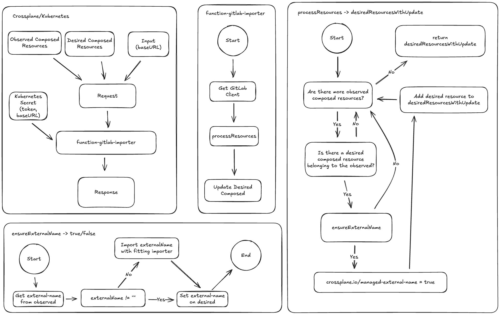

# function-gitlab-importer
[](https://github.com/simon-fredrich/function-gitlab-importer/actions/workflows/ci.yml)

## Overview
This [composition function][docs-functions] allows you to auto-import GitLab groups/projects into your crossplane environment if they already exist in your account. It works with CustomResourceDefinitions provided by [provider-gitlab][provider-gitlab] but can be easily extended to work with other definitions if desired. The function works best when used as a pipeline-step within a crossplane composition.

## Architecture
Below you can see how the core components of the function work together to keep resources syncronized.


## Inputs & Outputs
As you can see in the architecture diagram, the function gets observed composed resources and desired composed resources from the composition in which the function is located in. You have the option to pass the `baseURL` on a per-call-level to the function.

It is mandatory to provide the function with a token to supply access to your gitlab content. This can be archived by creating a kubernetes secret and integrating it into a `DeploymentRuntimeConfig` which you reference in the installation of the function.


## Configuration
This function requires certain environment variables and secrets to connect to Kubernetes and GitLab. Make sure these are set before deploying.
- `BASE_URL` – Base URL for the GitLab instance.
- `GITLAB_TOKEN` – Personal access token for GitLab.
- `managementPolicies` - configure management policies for your imported resources. The default setting is observe-only.
### Setting `baseURL` within the Input (optional)
```yaml
- step: run-function
  functionRef:
    name: function-gitlab-importer
  input:
    apiVersion: template.fn.crossplane.io/v1beta1
    kind: Input
    baseURL: <gitlab-baseUrl>
```
### Setting `managementPolicies` within the Input (optional, defaults to observe-only)
```yaml
- step: run-function
  functionRef:
    name: function-gitlab-importer
  input:
    apiVersion: template.fn.crossplane.io/v1beta1
    kind: Input
    managementPolicies:
    - Observe # default if input "managementPolicies" not used
    - Update
    - Delete
```
### Kubernetes Secret
```shell
$ kubectl create secret generic gitlab-credentials -n crossplane-system --from-literal=token="<PERSONAL_ACCESS_TOKEN>"
```

### `DeploymentRuntimeConfig`
```yaml
apiVersion: pkg.crossplane.io/v1beta1
kind: DeploymentRuntimeConfig
metadata:
  name: gitlab-credentials-config
spec:
  deploymentTemplate:
    spec:
      selector: {}
      template:
        spec:
          containers:
            - name: package-runtime
              env:
                - name: GITLAB_API_KEY
                  valueFrom:
                    secretKeyRef:
                      key: token
                      name: gitlab-credentials
                - name: GITLAB_URL
                  value: https://gitlab.com/
```

If you do not provide a `baseURL` then the default `https://gitlab.com` will be used.
## Installation
### Install Manifest
This is how your `function-gitlab-importer.yaml` can look like:
```yaml
apiVersion: pkg.crossplane.io/v1beta1
kind: Function
metadata:
  name: function-gitlab-importer
spec:
  package: ghcr.io/simon-fredrich/function-gitlab-importer:v0.3.0
  runtimeConfigRef:
    name: gitlab-credentials-config
```
### Deploy in Kubernetes
```shell
$ kubectl apply -f function-gitlab-importer.yaml
```
## Usage
### GitLab Group
Using go-templating your `composition.yaml` could look like this:
```yaml
apiVersion: apiextensions.crossplane.io/v1
kind: Composition
metadata:
  name: simple-group
spec:
  compositeTypeRef:
    apiVersion: gitlab.example.org/v1alpha1
    kind: SimpleGroup
  mode: Pipeline
  pipeline:
    - step: render-templates
      functionRef:
        name: crossplane-contrib-function-go-templating
      input:
        apiVersion: gotemplating.fn.crossplane.io/v1beta1
        kind: GoTemplate
        source: Inline
        inline:
          template: |
            ---
            apiVersion: groups.gitlab.crossplane.io/v1alpha1
            kind: Group
            metadata:
              name: {{ .observed.composite.resource.metadata.name }}
              annotations:
                gotemplating.fn.crossplane.io/composition-resource-name: {{ .observed.composite.resource.spec.groupName }}-{{ .observed.composite.resource.metadata.name }}-crn
            spec:
              forProvider:
                name: {{ .observed.composite.resource.spec.groupName }}
                path: {{ .observed.composite.resource.spec.groupName }}
                parentId: {{ .observed.composite.resource.spec.namespaceId}}
              providerConfigRef:
                name: gitlab-provider
    - step: check-template
      functionRef:
        name: function-gitlab-importer
    - step: ensure-readiness
      functionRef:
        name: crossplane-contrib-function-auto-ready
```
Additionally you have to provide a `CustomResourceDefinition`:
```yaml
apiVersion: apiextensions.crossplane.io/v1
kind: CompositeResourceDefinition
metadata:
  name: simplegroups.gitlab.example.org
spec:
  group: gitlab.example.org
  names:
    kind: SimpleGroup
    plural: simplegroups
  versions:
    - name: v1alpha1
      served: true
      referenceable: true
      schema:
        openAPIV3Schema:
          type: object
          properties:
            spec:
              type: object
              properties:
                namespaceId:
                  type: integer
                groupName:
                  type: stringUu
```
To be complete, here a custom resource which uses the definitions above:
```yaml
apiVersion: gitlab.example.org/v1alpha1
kind: SimpleGroup
metadata:
  name: simple-group-one
  namespace: simplegroups.gitlab.example.org
spec:
  groupName: <group-to-import>
  namespaceId: <your namespaceId>
```
### GitLab Project
Similarly you can manage GitLab Projects. Browse `examples/` to see how it is done.

## Development
You can run the function locally for development and testing purposes by utilizing the [crossplane cli][cli]. To get started create the following file to use the function locally. Optionally you can use the examples located in `examples/`.
```yaml
apiVersion: pkg.crossplane.io/v1beta1
kind: Function
metadata:
  name: function-gitlab-importer
  annotations:
    # This tells crossplane beta render to connect to the function locally.
    render.crossplane.io/runtime: Development
spec:
  # This is ignored when using the Development runtime.
  package: ghcr.io/simon-fredrich/function-gitlab-importer:<tag>
```
### Environment Variables
The `baseURL` can also be specified within the environment as a standard for every function-call. If it is neither specified in the input nor in the environment, the function will fall back to `https://gitlab.com`. Your authentication `token` can only be specified in the environment for security reasons. For that you have to specify the following variables.
```shell
$ export GITLAB_API_TOKEN=<gitlab-api-token>
$ export GITLAB_URL=<gitlab_url> (optional)
```
### Run Function
Open a terminal and run the following command in the project directory.
```shell
$ go run . --insecure --debug
```
To test the function one might need [additional resources][extra-resources]. As an example, you can create a GitLab project using the following command in a second terminal.
```shell
$ crossplane render \
  --observed-resources ./examples/project/observed \
  --include-full-xr \
  --include-context \
  xr.yaml composition.yaml functions.yaml
```

[docs-functions]: https://docs.crossplane.io/v1.14/concepts/composition-functions/
[cli]: https://docs.crossplane.io/latest/cli
[extra-resources]: https://docs.crossplane.io/latest/concepts/composition-functions/#how-composition-functions-work
[gitlab]: https://gitlab.com
[provider-gitlab]: https://github.com/crossplane-contrib/provider-gitlab